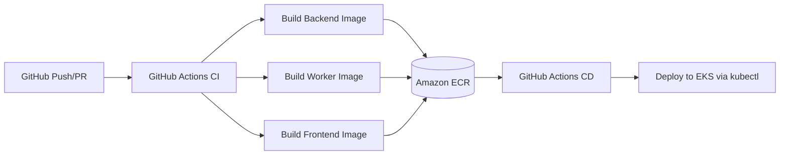
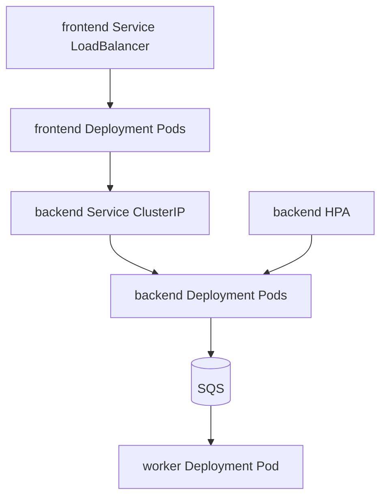
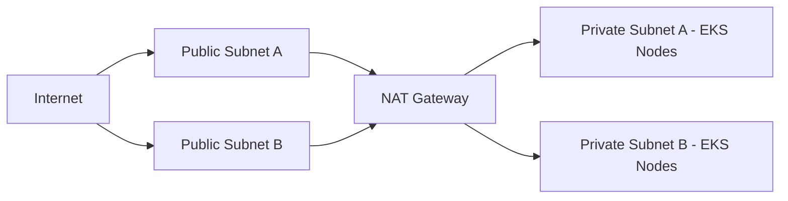

# Helpdesk PFE (Flask + Next.js + AWS DevOps)

Minimal full-stack helpdesk app designed for a DevOps/AWS PFE with very small codebase.

## Stack
- Frontend: Next.js (UI)
- Backend API: Flask (tickets + logs)
- Async worker: Python consumer for AWS SQS
- Containers: Docker
- Orchestration: Kubernetes (Amazon EKS)
- IaC: Terraform
- CI/CD: GitHub Actions
- Observability: CloudWatch-ready logs and metrics

## Project Structure
- `frontend/` Next.js app
- `backend/` Flask API + SQS worker
- `k8s/helpdesk.yaml` K8s Deployments/Services/HPA/Config
- `terraform/` AWS infra (VPC + EKS + SQS)
- `.github/workflows/cicd.yml` CI/CD pipeline

## Local Run
1. Copy `.env.example` to `.env` and adapt values.
2. Run:
```bash
docker compose up --build
```
3. Open:
- UI: http://localhost:3000
- API health: http://localhost:5000/health

## AWS Architecture Diagram
```mermaid
flowchart LR
  U[User Browser] --> ALB[Service LoadBalancer]
  ALB --> FE[Frontend Pods Next.js]
  FE --> BE[Backend Pods Flask]
  BE --> SQS[(SQS Queue)]
  SQS --> WK[Worker Pod]
  FE --> CW[CloudWatch Logs]
  BE --> CW
  WK --> CW

  subgraph EKS Cluster
    FE
    BE
    WK
  end

  subgraph VPC
    EKS Cluster
    SQS
  end
```

## CI/CD Pipeline Diagram


## Kubernetes Diagram


## Network Diagram (VPC)


## Terraform
```bash
cd terraform
terraform init
terraform apply
```
Outputs include EKS cluster name and SQS queue URL.

## Kubernetes Deploy
1. Replace images dynamically (already done in CI) or manually.
2. Apply manifests:
```bash
kubectl apply -f k8s/helpdesk.yaml
```

## Required GitHub Secrets
- `AWS_ROLE_ARN`
- `ECR_BACKEND`
- `ECR_WORKER`
- `ECR_FRONTEND`

## Mapping to PFE Requirements
- Part 1: App frontend + backend + env vars + logs
- Part 2: Dockerfiles + docker-compose
- Part 3: VPC/IAM-ready via Terraform and AWS credentials model
- Part 4: EKS manifests + HPA + rolling updates by Deployment strategy
- Part 5: Terraform for VPC/EKS/SQS
- Part 6: GitHub Actions CI/CD
- Part 7: SQS producer + worker consumer + DLQ
- Part 8: CloudWatch-ready container logs + dashboard/alerts to configure in AWS console
- Part 9: Secrets in K8s secret, IAM least privilege via role assumption

## Presentation Tips (45 min)
1. Demo local app quickly (tickets flow).
2. Show Terraform plan and created AWS resources.
3. Show pipeline run and EKS deployment.
4. Show CloudWatch logs and one alert example.
5. Explain cost and security choices.
